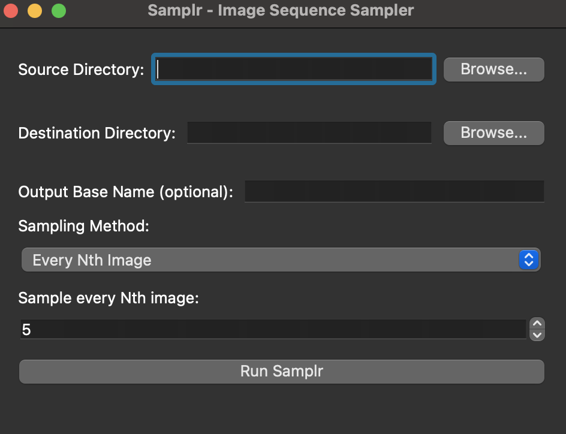

# Samplr

A Python tool for sampling images based on various criteria. Samplr can help you select and organize images from a source directory based on different sampling strategies.

## Features

- Sample every Nth image from a directory
- Sample images closest to a specific time each day
- Sample every Nth image within a specified time range
- Automatically rename selected images sequentially
- Preserves original files while creating copies in the destination directory
- Customizable output file naming

## Why this script?

When you have thousands of images for a time lapse in a source directory, sometimes it becomes really difficult to use them all. You might want to just grab every 10th image to make the time lapse go a lot faster, or maybe you want to grab the image closest to 12:00 noon each day, or maybe you just want to grab every 10th image between 9am and 5pm each day to get the times with the most action. Samplr is here to help!

This is primarily used for long-term time lapse image sampling, but use it how you like!


## Installation

```bash
pip install .
```

If you don't want to install, that's fine.  You can just run it on the command like like this:
```bash
python -m samplr.cli /path/to/source /path/to/destination --every-nth 5
```

## Usage

Samplr provides three main sampling strategies:

### 1. Sample Every Nth Image

```bash
samplr /path/to/source /path/to/destination --every-nth 5
```

This will copy every 5th image from the source directory to the destination directory.

### 2. Sample Closest to Time

```bash
samplr /path/to/source /path/to/destination --closest-to 14:30
```

This will select the image closest to 2:30 PM each day and copy it to the destination directory.

### 3. Sample Every Nth Image in Time Range

```bash
samplr /path/to/source /path/to/destination --time-range 3 09:00 17:00
```

This will select every 3rd image that was taken between 9:00 AM and 5:00 PM each day.

### Custom Output File Names

By default, output files are named based on the first image in the source directory, with "CO" replaced by "SM". For example, if your source images are named "CO_001.jpg", the output will be "SM_0001.jpg".

You can specify a custom base name using the `--base-name` option:

```bash
samplr /path/to/source /path/to/destination --every-nth 5 --base-name "my_images"
```

This will create files like "my_images_0001.jpg", "my_images_0002.jpg", etc.

## Notes

- Time should be specified in 24-hour format (HH:MM)
- Supported image formats: JPG, JPEG, PNG, GIF
- The tool uses EXIF data when available, falling back to file modification time if EXIF data is not present
- Images in the destination directory will be renamed sequentially (e.g., image_0001.jpg, image_0002.jpg, etc.)

## Requirements

- Python 3.7 or higher
- Pillow
- python-dateutil

## Desktop GUI

Samplr also includes a modern desktop GUI for easy image sampling. To use it:

1. Install the package with GUI dependencies:
   ```bash
   pip install samplr[gui]
   ```

2. Run the desktop UI:
   ```bash
   python -m samplr.desktop_ui
   ```

The GUI provides:
- File pickers for source and destination directories
- Dropdown menu for sampling method selection
- Input fields for sampling parameters (Nth value, time ranges)
- Optional custom base name for output files
- Status updates and error reporting



## Development

### Setup

1. Clone the repository:
   ```bash
   git clone https://github.com/timelapsetech/samplr.git
   cd samplr
   ```

2. Create and activate a virtual environment:
   ```bash
   python -m venv venv
   source venv/bin/activate  # On Windows: venv\Scripts\activate
   ```

3. Install development dependencies:
   ```bash
   pip install -e ".[dev]"
   ```

### Running Tests

```bash
pytest
```

### Running Tests with Coverage

```bash
pytest --cov=samplr --cov-report=term-missing
```

## License

MIT License - see LICENSE file for details.
