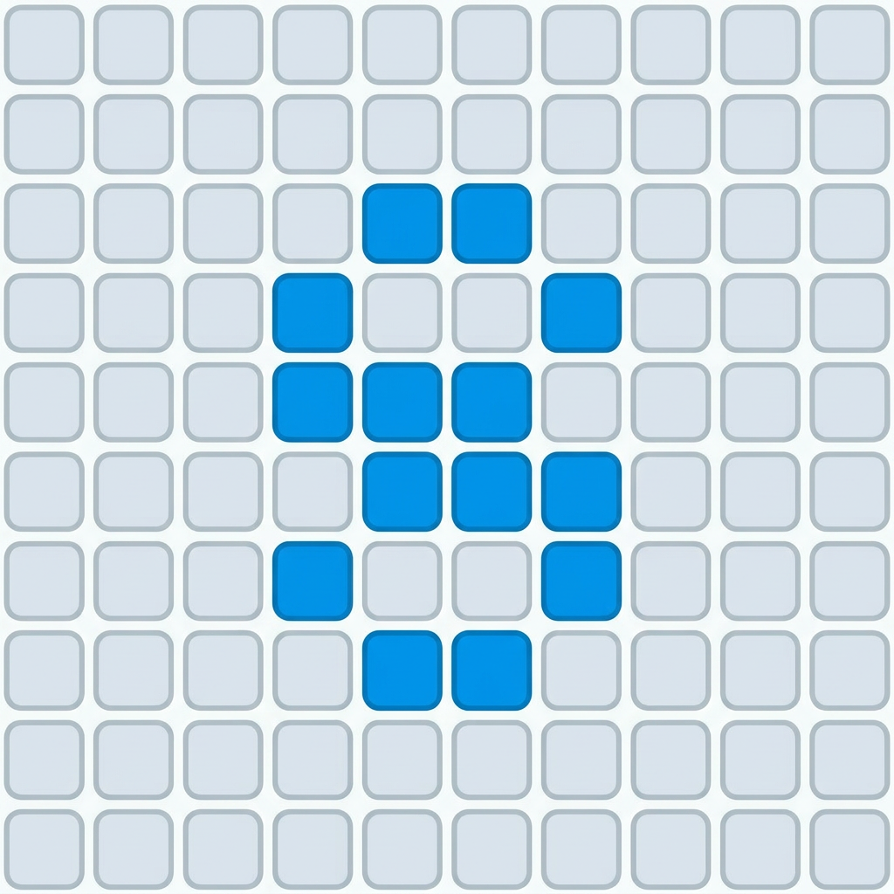
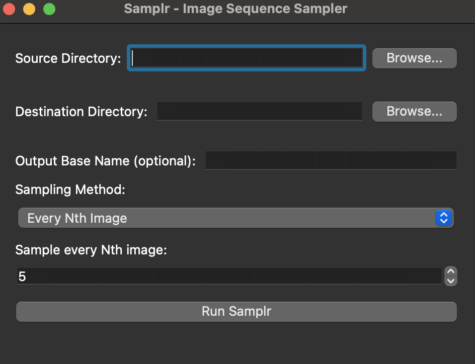

<p align="center">
  
</p>

# Samplr

A Python tool for sampling images based on various criteria. Samplr can help you select and organize images from a source directory based on different sampling strategies.

## Features

- Sample every Nth image from a directory
- Sample images closest to a specific time each day
- Sample every Nth image within a specified time range
- Optionally remove black frames (camera-off or lens-cap shots) with a configurable tolerance
- Automatically rename selected images sequentially
- Preserves original files while creating copies in the destination directory
- Validates that source and destination are separate folders to protect originals
- Customizable output file naming

## Why this script?

When you have thousands of images for a time lapse in a source directory, sometimes it becomes really difficult to use them all. You might want to just grab every 10th image to make the time lapse go a lot faster, or maybe you want to grab the image closest to 12:00 noon each day, or maybe you just want to grab every 10th image between 9am and 5pm each day to get the times with the most action. Samplr is here to help!

This is primarily used for long-term time lapse image sampling, but use it how you like!


## Installation

```bash
pip install .
```

If you don't want to install, that's fine. You can just run it on the command line like this:
```bash
python -m samplr.cli /path/to/source /path/to/destination --every-nth 5
```

## Usage

Samplr provides three main sampling strategies:

### 1. Sample Every Nth Image

```bash
samplr /path/to/source /path/to/destination --every-nth 5
```

This will copy every 5th image from the source directory to the destination directory.

### 2. Sample Closest to Time

```bash
samplr /path/to/source /path/to/destination --closest-to 14:30
```

This will select the image closest to 2:30 PM each day and copy it to the destination directory.

### 3. Sample Every Nth Image in Time Range

```bash
samplr /path/to/source /path/to/destination --time-range 3 09:00 17:00
```

This will select every 3rd image that was taken between 9:00 AM and 5:00 PM each day.

### Custom Output File Names

By default, output files are named based on the first image in the source directory, with "CO" replaced by "SM". For example, if your source images are named "CO_001.jpg", the output will be "SM_0001.jpg".

You can specify a custom base name using the `--base-name` option:

```bash
samplr /path/to/source /path/to/destination --every-nth 5 --base-name "my_images"
```

This will create files like "my_images_0001.jpg", "my_images_0002.jpg", etc.

### Remove Black Frames

Long-term time lapse sequences often include black frames when the camera is off or the lens is covered. Samplr can drop those after sampling, before copying to the destination.

```bash
samplr /path/to/source /path/to/destination --every-nth 5 --remove-black-frames --black-frame-tolerance 95
```

`--black-frame-tolerance` is the percentage of the frame that must be near-black for the image to be excluded (default: 95). Use a higher value (for example 100) to remove only fully black frames; use a lower value to catch partially black frames as well.

Black-frame checks run only on the sampled subset, not every file in the source folder. Detection uses a fast downsampled grayscale histogram so large batches stay responsive.

## Notes

- Time should be specified in 24-hour format (HH:MM)
- Supported image formats: JPG, JPEG, PNG, GIF
- The tool uses EXIF data when available, falling back to file modification time if EXIF data is not present
- “Closest to time each day” relies on accurate per-image timestamps from EXIF or file modification time
- Source and destination must be different directories; neither folder can be inside the other
- Samplr only copies files — it never moves, renames, or deletes images in the source directory
- Images in the destination directory will be renamed sequentially (e.g., `SM_0001.jpg`, `SM_0002.jpg`, etc.)

## Requirements

- Python 3.7 or higher
- Pillow
- python-dateutil

## Desktop GUI

Samplr also includes a modern desktop GUI for easy image sampling. To use it:

1. Install the package with GUI dependencies:
   ```bash
   pip install samplr[gui]
   ```

2. Run the desktop UI:
   ```bash
   python -m samplr.desktop_ui
   ```

The GUI provides:
- File pickers for source and destination directories
- Dropdown menu for sampling method selection
- Input fields for sampling parameters (Nth value, time ranges); N accepts any positive whole number (e.g. 100 or 1000)
- Optional custom base name for output files
- Optional black frame removal with configurable tolerance (shown when enabled)
- Progress bar and per-file status while sampling runs
- Validation that source and destination are safe, separate folders
- Status updates and error reporting

The GUI now includes improved widget handling to prevent errors related to deleted widgets (such as 'wrapped C/C++ object of type QSpinBox has been deleted'), making the interface more robust when switching sampling methods.



## macOS App (PyInstaller)

Build a standalone `Samplr.app` you can install without Python on the machine:

```bash
./scripts/build-macos.sh
```

That script installs dependencies, generates the macOS app icon from `assets/samplr_logo.png`, and runs PyInstaller.

Or manually:

```bash
python3 -m venv venv
source venv/bin/activate
pip install -e ".[gui,packaging]"
./scripts/generate-macos-icon.sh
pyinstaller samplr.spec
```

The app bundle is written to `dist/Samplr.app` (typically ~90–100 MB). Install it with:

```bash
cp -r dist/Samplr.app /Applications/
open /Applications/Samplr.app
```

On first launch, macOS may block the unsigned app. Right-click **Samplr** in Applications, choose **Open**, then confirm **Open**.

PyInstaller may print a `user32` warning on macOS when analyzing dependencies; that is harmless. The spec file intentionally bundles only the Qt modules the app uses, which keeps the build output smaller and avoids dozens of optional Qt plugin warnings.

### Publish a GitHub Release (local build)

A normal `git push` only uploads source code. The built app stays on your machine (`dist/` is gitignored), so publishing a release is a separate step that uploads the local `.app` to [GitHub Releases](https://github.com/timelapsetech/samplr/releases).

One-time setup:

```bash
brew install gh
gh auth login
```

When you are ready to ship a version:

1. Bump `samplr/__init__.py` and document changes in `CHANGELOG.md`
2. Commit and push your changes
3. Run:

```bash
./scripts/release-macos.sh
```

That script will:

- Build `dist/Samplr.app` locally (PyInstaller)
- Zip it as `dist/Samplr-<version>-macos.zip`
- Create tag `v<version>` from the current commit (for example `v0.3.0`)
- Push the branch and tag to GitHub
- Create or update the GitHub Release with the zip attached

Release notes are taken from the matching `CHANGELOG.md` section.

To publish an app you already built:

```bash
SKIP_BUILD=1 ./scripts/release-macos.sh
```

## Development

### Setup

1. Clone the repository:
   ```bash
   git clone https://github.com/timelapsetech/samplr.git
   cd samplr
   ```

2. Create and activate a virtual environment:
   ```bash
   python -m venv venv
   source venv/bin/activate  # On Windows: venv\Scripts\activate
   ```

3. Install development dependencies:
   ```bash
   pip install -e ".[dev]"
   ```

### Running Tests

```bash
pytest
```

### Running Tests with Coverage

```bash
pytest --cov=samplr --cov-report=term-missing
```

## License

MIT License - see LICENSE file for details.
